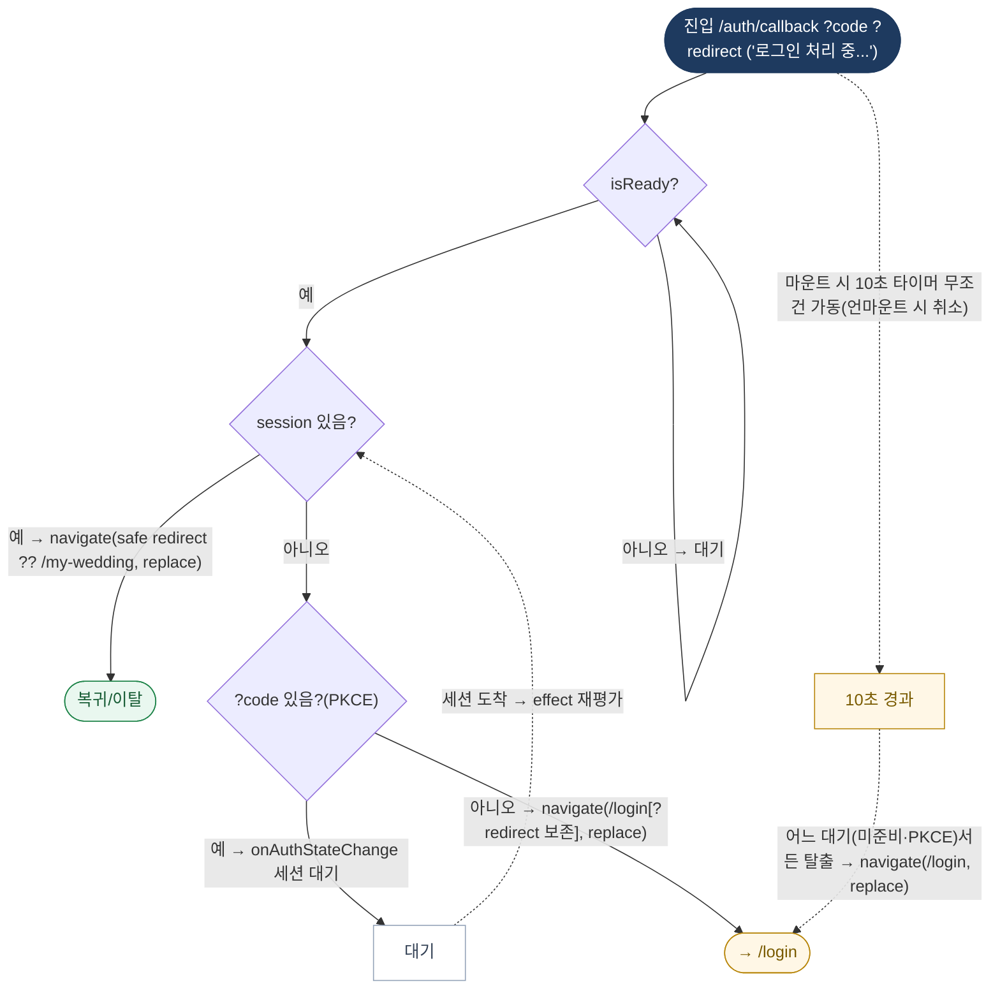

# AuthCallbackPage — 원자 단위 상태/액티비티 다이어그램

- **라우트:** `/auth/callback` (`?code`, `?redirect`)
- **검증:** ✅ Opus 4.8 (2라운드 — 10초 타임아웃 페이지 레벨로 정정)
- **요약:** 머신 없음. isReady 대기 → session 있으면 복귀/이탈, 없으면 code(PKCE) 있으면 세션 대기, 없으면 /login. 마운트 시 10초 타임아웃이 페이지 레벨로 무조건 가동되어 어느 대기서든 /login으로 탈출.

