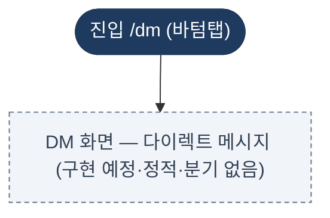

# DmPage — 원자 단위 상태/액티비티 다이어그램

- **라우트:** `/dm` (바텀탭)
- **검증:** ✅ Opus 4.8 (1라운드)
- **요약:** 스텁. 다이렉트 메시지 구현 예정. 정적 화면, 분기·상태 없음.

```mermaid
flowchart TB
  classDef term fill:#1E3A5F,stroke:#1E3A5F,color:#fff;
  classDef flat fill:#f1f5f9,stroke:#64748b,stroke-dasharray:4 3,color:#334155;
  START(["진입 /dm (바텀탭)"]):::term --> screen["DM 화면 — 다이렉트 메시지 (구현 예정·정적·분기 없음)"]:::flat
```
