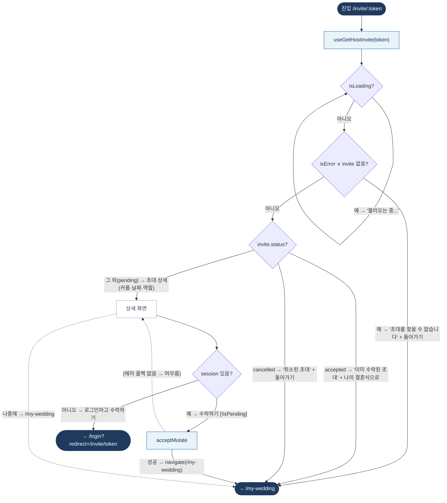

# HostInviteAcceptPage — 원자 단위 상태/액티비티 다이어그램

- **라우트:** `/invite/:token`
- **검증:** ✅ Opus 4.8 (1라운드)
- **요약:** 머신 없음. 초대 조회 로딩/에러 → status(accepted/cancelled/pending) 분기. pending이면 session 있으면 수락(→/my-wedding), 없으면 로그인 후 수락.

