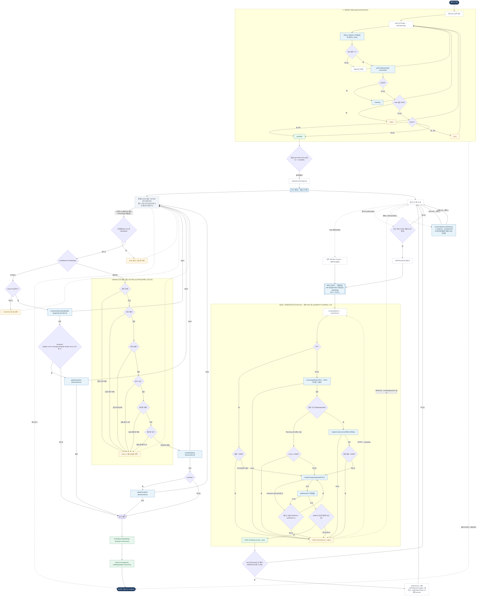

# InvitationCreatePage — 원자 단위 상태/액티비티 다이어그램

- **라우트:** `/invitation/create`
- **검증:** ✅ Opus 4.8 (2라운드)
- **요약:** xstate `invitationCreate.machine`는 **미사용**. 실제 런타임은 `useState(slugConfirmed)` + zustand + 훅. 처음에 공유링크(slug) 모달 → `available`에서만 확인 → fork(편집 ∥ 업로드 트랙) → 저장(업로드중 가드 → 추가/생성 모드 → 조건부 updateInvitation). 업로드 파이프라인은 압축(GIF/HEIC/비압축형/한도) → presigned(presign/PUT/autoRetry 1) → publicUrl 검증(retry 밖).

