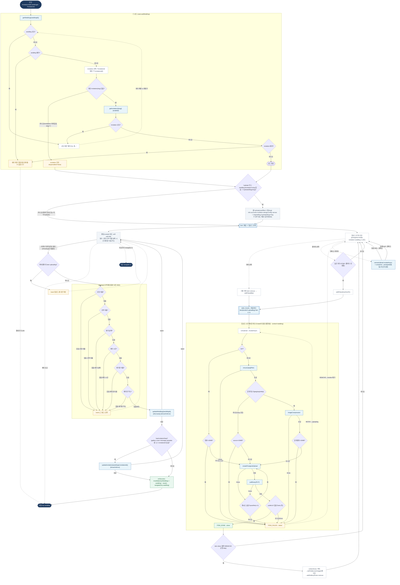

# InvitationEditPage — 원자 단위 상태/액티비티 다이어그램

- **라우트:** `/invitation/edit/:weddingId` (`?invitationId`)
- **검증:** ✅ Opus 4.8 (1라운드)
- **요약:** xstate `invitationEdit.machine` **미사용**(Create와 동일). 차이: slug 모달 없음(로드→hydrate), 앞단 로드(getWedding→getInvitation)·hydrate(slug당 1회 가드), 저장은 단일 update(updateWedding→조건부 updateInvitation·hasInvitationData 4필드·invalidate myWeddings+wedding), 뒤로가기·unmount reset. 업로드 파이프라인은 Create와 동일(context=wedding).

