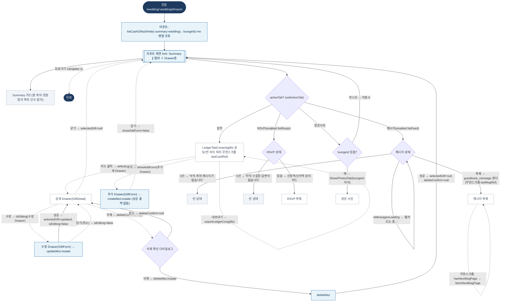

# LedgerPage — 원자 단위 상태/액티비티 다이어그램

- **라우트:** `/wedding/:weddingId/report`
- **검증:** ✅ Opus 4.8 (2라운드 — 메시지탭 로딩/빈상태·편집 Drawer 닫기·받은사진 loungeId 가드 보강)
- **요약:** 머신 없음. 4탭(장부/메시지/RSVP/받은사진, 선택 시 enabled 조회)·두 개의 독립 무한스크롤·Drawer 스택(상세→수정/삭제, 추가)·CSV. 뒤로 navigate(-1).

