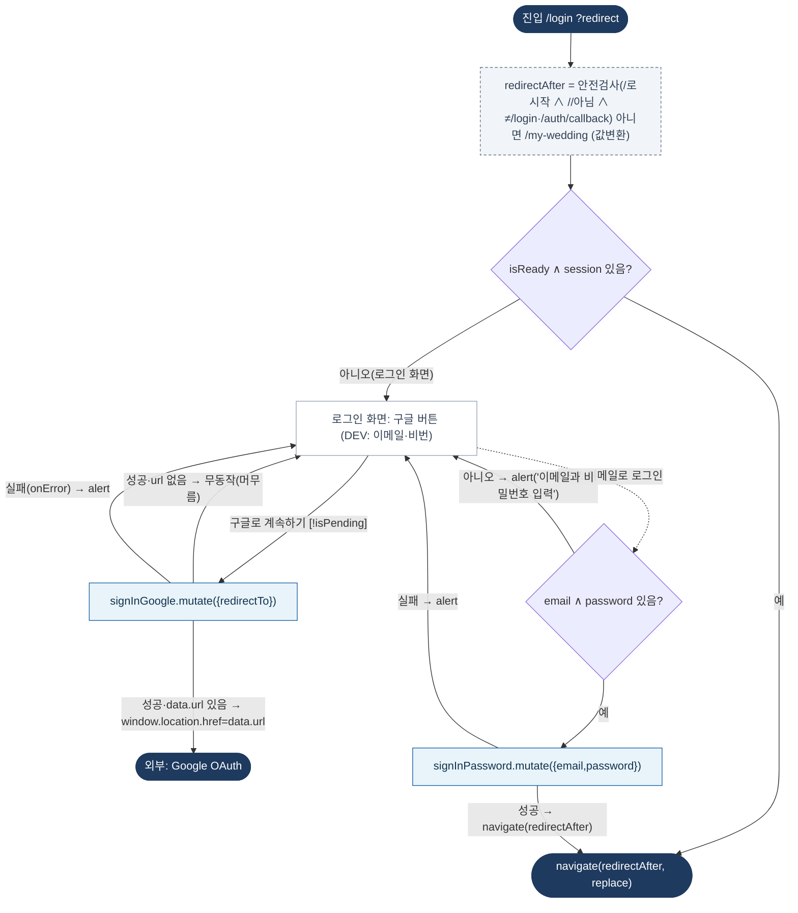

# LoginPage — 원자 단위 상태/액티비티 다이어그램

- **라우트:** `/login` (`?redirect`)
- **검증:** ✅ Opus 4.8 (1라운드)
- **요약:** 머신 없음(React Query+useState). 이미 로그인이면 redirect로. 구글 OAuth(성공 시 url로 이동)·DEV 이메일 로그인. redirect 안전검사.

> 노트: 버튼 disabled = signInGoogle.isPending ∨ signInPassword.isPending. DEV 블록은 `import.meta.env.DEV`. redirectTo = redirectAfter≠/my-wedding이면 콜백 URL에 `?redirect` 부착.
