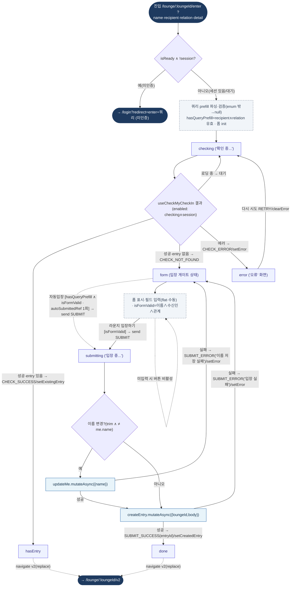

# LoungeCheckInGatePage — 원자 단위 상태/액티비티 다이어그램

- **라우트:** `/lounge/:loungeId/enter` (`?name·recipient_slot·relation_category·relation_detail`)
- **검증:** ✅ Opus 4.8 (2라운드)
- **요약:** xstate `loungeCheckInGate.machine` **실제 구동**(checking→hasEntry/form/error · form→submitting→done/form). 페이지 고유: 인증 가드(미인증→로그인 리다이렉트), checking↔쿼리 브리지, guest-web 쿼리 prefill→자동입장(1회), handleSubmit(이름 변경 시 updateMe→createEntry, 각 실패 분기), hasEntry/done→v2 리다이렉트. 비동기는 actor 아닌 페이지 측.

