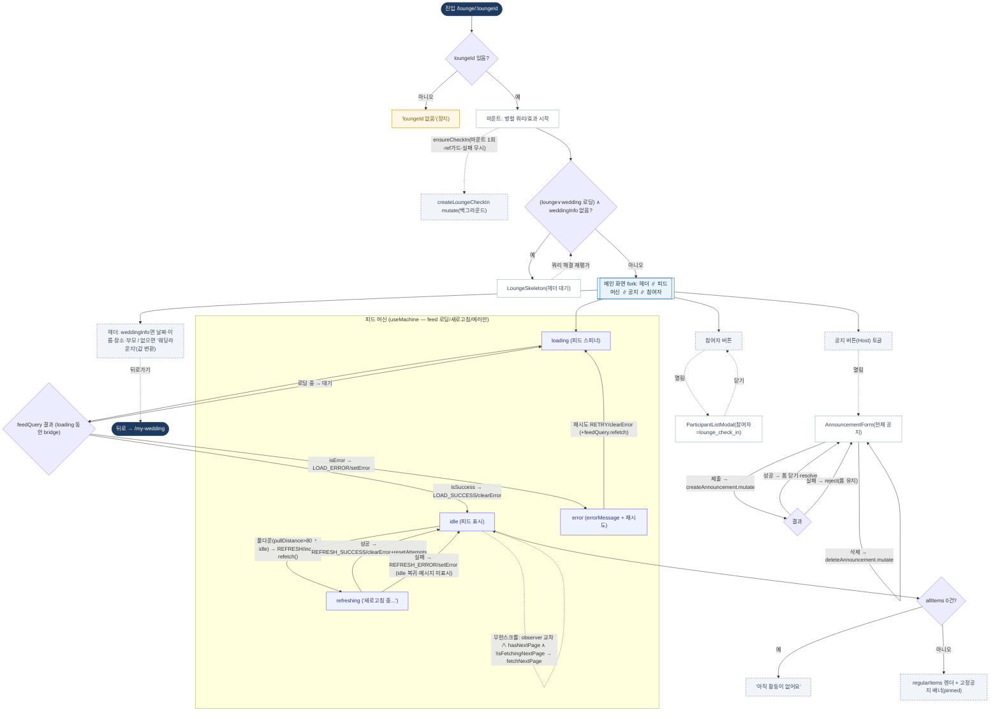

# LoungeFeedPage — 원자 단위 상태/액티비티 다이어그램

- **라우트:** `/lounge/:loungeId`
- **검증:** ✅ Opus 4.8 (1라운드)
- **요약:** xstate `loungeFeed.machine` **실제 구동**이나 **피드 영역만** 관장(loading/idle/refreshing/error). 주위로 헤더·공지·참여자가 병렬. idle에서 5초 폴링(refetchInterval)+무한스크롤이 백그라운드(상태 무변), 풀다운만 refreshing 전이. ensureCheckIn 마운트 1회 fire-and-forget. 뒤로가기→/my-wedding.

