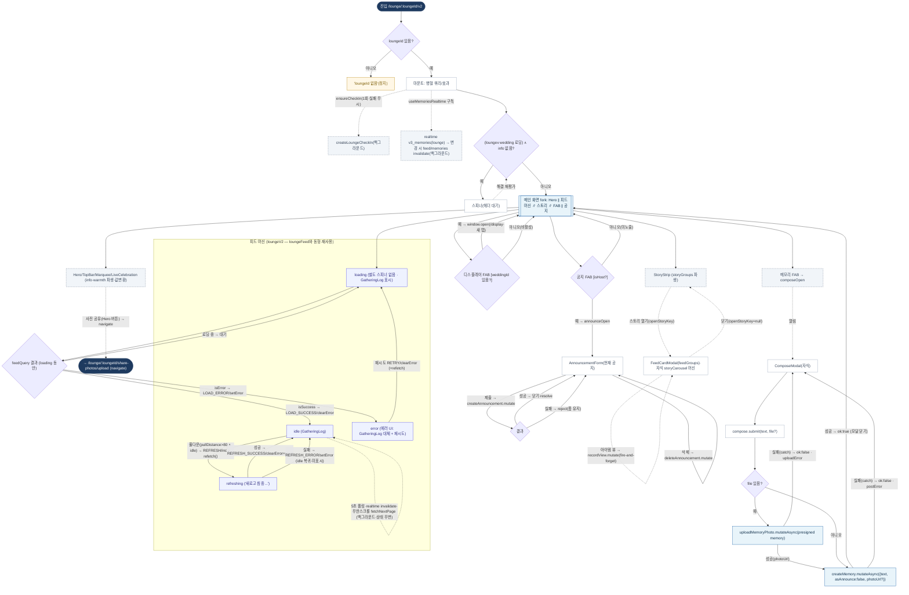

# LoungeV2Page — 원자 단위 상태/액티비티 다이어그램

- **라우트:** `/lounge/:loungeId/v2`
- **검증:** ✅ Opus 4.8 (1라운드)
- **요약:** xstate `loungeV2.machine`는 `loungeFeed`와 **동형**(피드 영역만·재사용). V2 추가: 실제 isHost(공지 FAB), compose(파일 업로드→메모리 생성, 각 실패), 실시간 구독(→feed invalidate), 스토리 모달(FeedCardModal=storyCarousel 자식), FAB 3종(공지·디스플레이=새 탭 window.open·메모리), 사진공유=라우트 이탈.

