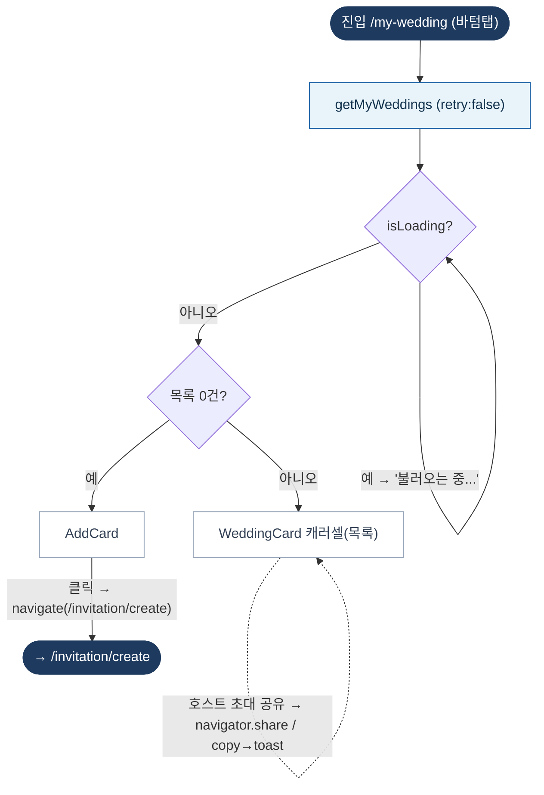

# MyWeddingPage — 원자 단위 상태/액티비티 다이어그램

- **라우트:** `/my-wedding` (바텀탭)
- **검증:** ✅ Opus 4.8 (1라운드)
- **요약:** 머신 없음. getMyWeddings 로딩/빈(AddCard→생성)/목록(WeddingCard). 카드 핸들러: 링크 복사·공유(navigator.share/copy)·미리보기(새 탭).

