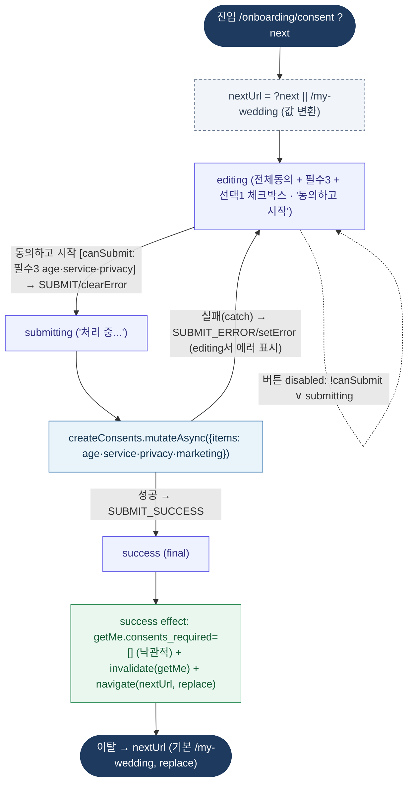

# OnboardingConsentPage — 원자 단위 상태/액티비티 다이어그램

- **라우트:** `/onboarding/consent` (`?next`)
- **검증:** ✅ Opus 4.8 (1라운드)
- **요약:** xstate `onboardingConsent.machine` **실제 구동**(editing→submitting→success). 토글(TOGGLE/TOGGLE_ALL)은 editing 자기전이. `동의하고 시작`은 canSubmit(필수 3개 age·service·privacy; marketing 선택)일 때만 SUBMIT→submitting. 제출은 createConsents.mutateAsync → 성공 SUBMIT_SUCCESS→success(final) / 실패 SUBMIT_ERROR→editing(에러 표시). success 진입 시 getMe 캐시 consents_required=[] 낙관적 갱신 + invalidate + navigate(nextUrl, replace). RETRY는 선언만 되고 미처리(dead).

