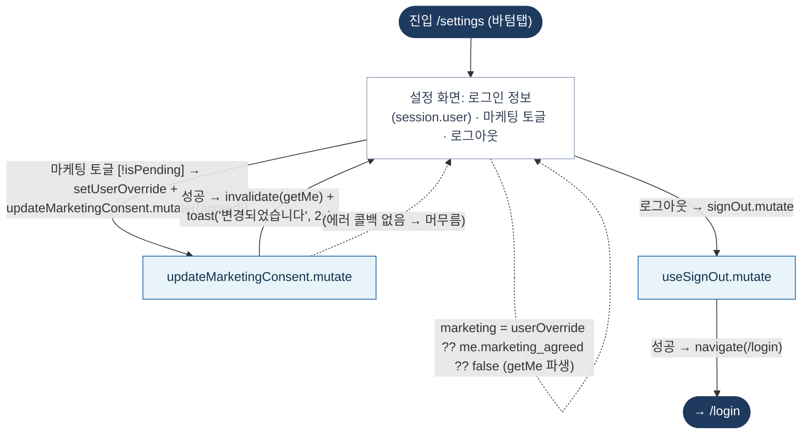

# SettingsPage — 원자 단위 상태/액티비티 다이어그램

- **라우트:** `/settings` (바텀탭)
- **검증:** ✅ Opus 4.8 (1라운드)
- **요약:** 머신 없음. 마케팅 동의는 서버값 파생+토글 override → mutate(성공 시 invalidate+토스트). 로그아웃 → /login.

```mermaid
flowchart TB
  classDef st fill:#fff,stroke:#94a3b8,color:#334155;
  classDef async fill:#E8F4FA,stroke:#185FA5,color:#13324d;
  classDef warn fill:#fff7e6,stroke:#b8860b,color:#7a5b00;
  classDef done fill:#e9f7ef,stroke:#1e8449,color:#145a32;
  classDef term fill:#1E3A5F,stroke:#1E3A5F,color:#fff;
  classDef flat fill:#f1f5f9,stroke:#64748b,stroke-dasharray:4 3,color:#334155;
  START(["진입 /settings (바텀탭)"]):::term --> screen["설정 화면: 로그인 정보(session.user) · 마케팅 토글 · 로그아웃"]:::st
  screen -. "marketing = userOverride ?? me.marketing_agreed ?? false (getMe 파생)" .-> screen
  screen -- "마케팅 토글 [!isPending] → setUserOverride + updateMarketingConsent.mutate({agreed})" --> mk["updateMarketingConsent.mutate"]:::async
  mk -- "성공 → invalidate(getMe) + toast('변경되었습니다', 2s)" --> screen
  mk -. "(에러 콜백 없음 → 머무름)" .-> screen
  screen -- "로그아웃 → signOut.mutate" --> so["useSignOut.mutate"]:::async
  so -- "성공 → navigate(/login)" --> EXITLOGIN(["→ /login"]):::term
```
