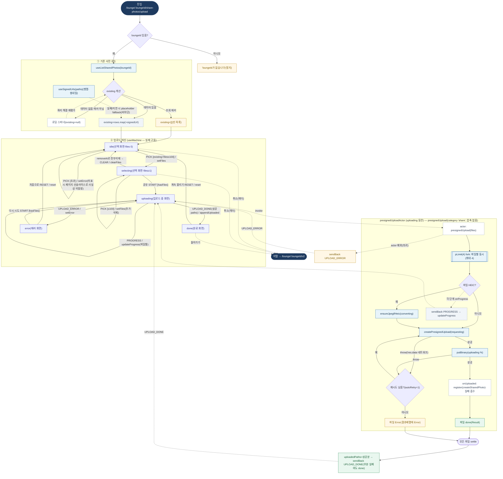

# SharePhotoUploadPage — 원자 단위 상태/액티비티 다이어그램

- **라우트:** `/lounge/:loungeId/share-photos/upload`
- **검증:** ✅ Opus 4.8 (1라운드)
- **요약:** xstate `sharePhotoUpload.machine` **실제 구동**(idle→selecting→uploading→done/error). uploading은 `presignedUploadActor` invoke → presignedUpload(category 'share', **압축 없음**, pLimit 4, autoRetry 1). 파일별 HEIC 변환→presign→PUT(재시도 1)→register(실패 흡수). **부분 실패여도 성공분만 모아 UPLOAD_DONE→done**, actor 예외 시에만 UPLOAD_ERROR→error. 외곽은 기존 사진 로드(list + signedUrls).

