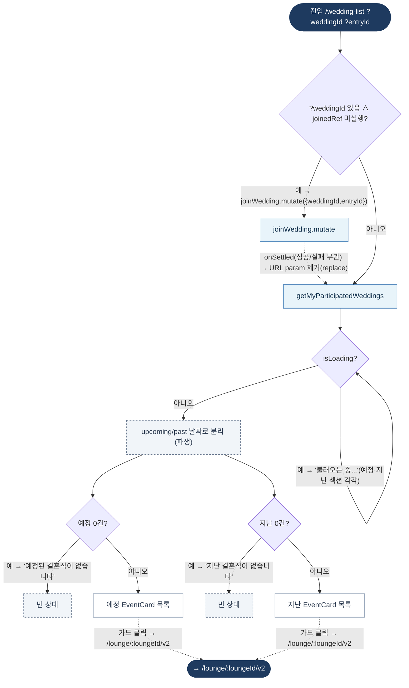

# WeddingListPage — 원자 단위 상태/액티비티 다이어그램

- **라우트:** `/wedding-list` (`?weddingId`, `?entryId`)
- **검증:** ✅ Opus 4.8 (1라운드)
- **요약:** 머신 없음. ?weddingId 있으면 join 1회(onSettled로 URL param 제거). 참여 결혼식 조회 → 예정/지난 분리 → EventCard → 라운지 v2.

