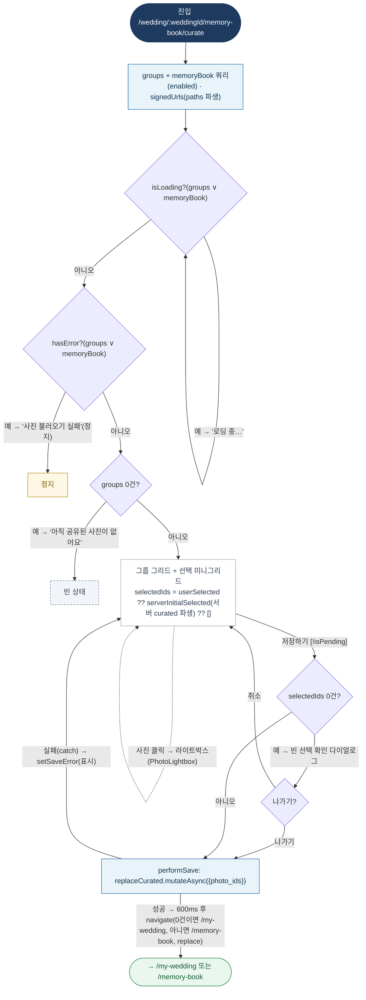

# WeddingMemoryBookCuratePage — 원자 단위 상태/액티비티 다이어그램

- **라우트:** `/wedding/:weddingId/memory-book/curate`
- **검증:** ✅ Opus 4.8 (1라운드)
- **요약:** 머신 없음. groups+memoryBook 병렬 조회 + signedUrls. selectedIds = userSelected ?? 서버 curated ?? []. 토글(30장 cap). 저장: 0건이면 확인 다이얼로그, 아니면 바로 → replaceCurated → 성공 시 600ms 후 이동.

