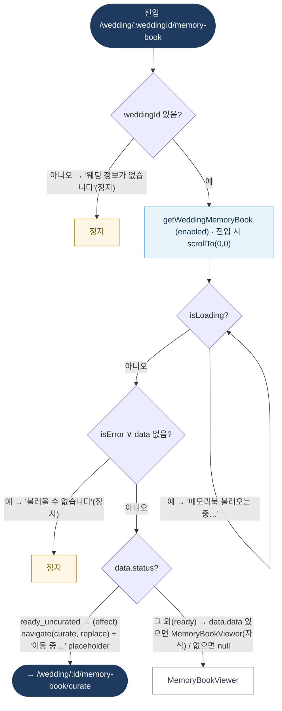

# WeddingMemoryBookPage — 원자 단위 상태/액티비티 다이어그램

- **라우트:** `/wedding/:weddingId/memory-book`
- **검증:** ✅ Opus 4.8 (1라운드)
- **요약:** 머신 없음. weddingId 가드 → 메모리북 조회 로딩/에러 → status: ready_uncurated면 큐레이션으로 리다이렉트(effect), ready면 MemoryBookViewer.

