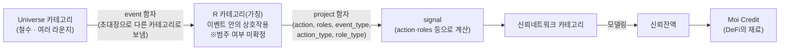
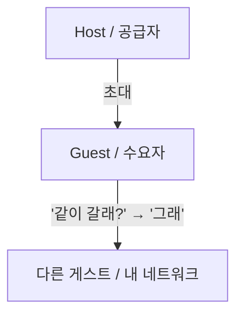
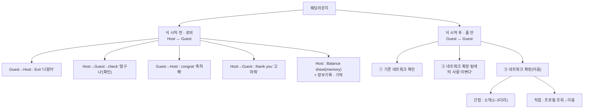
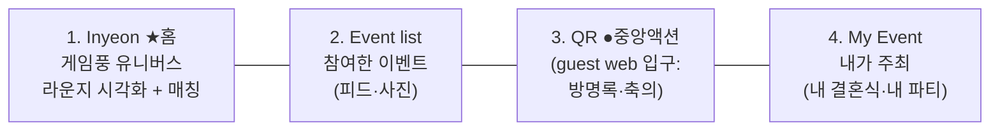

# 고래유니버스 / 디방 — 해커톤 전체 흐름 (개념 정리)

> 작성일: 2026-06-16 · 출처: 화이트보드 "전체흐름"(하얀 카드) + 유상 구술 정리
> 목적: 손글씨로 흩어진 전체 개념을 개발 작업이 가능한 형태로 정확히 옮긴다.

---

## 0. 두 개의 층을 먼저 구분

이 문서는 두 가지가 섞여 있던 화이트보드를 두 층으로 나눠 정리한다.

- **(A) 모델/목표 층** = 범주론 파이프라인. 결국 무엇을 산출하려는가. → §1
- **(B) 리얼월드 기획 층** = **하얀 카드**. "현실에서 어떤 일이 일어나는가 → 무엇을 기획해야 하는가." → §2~§3

> 하얀 카드 = "실제 리얼월드에서 어떤 일들이 일어나지? 를 고민하며 무엇을 기획해야 하지? 생각한 것들."

---

## 1. 큰 흐름 — 범주론 파이프라인 (모델/목표)

한 줄 요약: **Universe 카테고리에서 `event` 함자로 다른 카테고리(R)로 보낸다 → R에서 `project` 함자로 signal을 계산 → 신뢰네트워크 카테고리로 보내 모델링 → 신뢰잔액 도출 → 최종적으로 DeFi의 재료가 될 Moi Credit 산출.**

이것이 해커톤이자 고래유니버스의 목표.

> ⚠️ **확정 아님:** 범주론 공부가 진행 중이라 R이 실제로 "카테고리"가 아닐 수도 있고, `event`/`project`가 엄밀한 의미의 함자(functor)가 아닐 수도 있음. 명칭은 잠정.

---

## 2. 하얀 카드 = 리얼월드 기획

### 2.1 [Universe 앞단] 디방 세계관 용어집

| 용어 | 의미 |
|---|---|
| **모이** | 나, 나 자신 |
| **모이가모인곳** | 기존 신뢰네트워크의 시각화 → 현재는 **Lounge 카테고리의 시각화** |
| **이음** | 동사. "1촌 맺기"의 의미 |
| **요네** | 생태계 화폐 단위. **SUI/USDC 등으로 충전**해서 사용. 선물하기·직접 축의 가능. (신뢰잔액·Moi Credit과는 **별개**의 결제 수단) |
| **사이** | 관계 |
| **떨림 / 진동** | (세계관 표현) |
| **우리의 온기(웨딩) / 우리의 열기(파티)** | Network contribution |
| **적극적 기여자 / 소극적 기여자** | 기여의 두 양태 |

### 2.2 [Universe 카테고리]

- **철수** = 나(페르소나).
- 싸이월드 미니룸처럼 생긴 **여러 라운지**가 있음 — 게임 같은 느낌.
- 철수는 **초대장을 받고(= event 함자)** 파티로 가거나 웨딩으로 이동한다.

### 2.3 [이벤트 함자 — Universe → 라운지로 보내는 화살표]

- **모바일청첩장 (웨딩):** Host가 Guest에게 초대 → Guest는 다른 게스트에게 "같이 갈래?" "그래" 상호작용. **(의무성)**
- **파티 초대장 (파티):** 공급자가 수요자에게 초대 → Guest는 자신의 다른 네트워크에게 "같이 갈래?" "그래" 상호작용. **(자발성)**

### 2.4 [라운지 카테고리]

> **[구조] 이벤트 내부 = 포이어 + 라운지.** 하나의 웨딩 이벤트에 들어가면 두 공간으로 나뉜다 (실제 웨딩 베뉴 구조 차용).
> - **핵심 프레이밍: 포이어 = Host ↔ Guest 상호작용 공간 / 라운지 = Guest ↔ Guest 상호작용에 초점.** (아래 2.4.1의 "시작 전 로비 = Host↔Guest / 시작 후 홀 = Guest↔Guest"와 정확히 매핑 — 포이어=로비, 라운지=홀.)
> - **포이어(Foyer)** = 예식홀 앞 로비/복도. **입구·실무·host 전용**: 축의·방명록(QR), 공지, 모이는 중(체크인·축하메세지), 들러리·선물(화환), **사진공유(host에게만 비공개 전달)**.
> - **라운지(Lounge)** = 머무는 휴게 공간(**싸이월드 미니룸식**, 디방인연 월드맵과 연결된 **이벤트 내부**). **공개 콘텐츠·어울림·꾸미기**: 메모리(공개 짧은 영상), 피드(공개 SNS 글+사진), 디스플레이, 샵. **사람들이 무리지어 있는 모습 자체가 '우리'**(익명 클러스터 — 이름 비공개, 누가 누구와 모여있는지만).
> - **가르는 기준: 공개 게시물(모두가 봄) = 라운지 / host 전용·입구 실무 = 포이어.**

#### 2.4.1 웨딩라운지

> **[현황·코드 정합]** 실제 앱의 웨딩 라운지는 **LoungeV2**로 이미 구현됨 — HeroCard · 공지 마퀴 · **우리의 온기 오브(온도°)** · 스토리 스트립 · GatheringLog 피드 · FAB(사진·디스플레이·온기 작성). 입장은 **'체크인'(자동, 청첩장 prefill — `LoungeCheckInGatePage`)**. 단 **현재는 Host↔Guest 상호작용만** 존재. 아래 **②/③의 Guest↔Guest(우리·이음·기여)는 신규 — 코드에 없음, 목업에서 설계.**

**시작 전 (로비) — Host ↔ Guest 상호작용**
1. Guest → Host : Exit "나왔어"
2. Host → Guest : check "왔구나" (확인)
3. Guest → Host : congrat "축하해"
4. Host → Guest : thank you "고마워"
5. Host : **Balance sheet (memory)** = 장부 기록 · 기억

**시작 후 (홀 안) — Guest ↔ Guest 상호작용**

**① 기존 네트워크 확인**
- 누구의 하객인지: **Host1**
- 어떤 관계인지: 객관식(a) + 주관식(ㄱ) (ex. 지인 / 친구 / 깐부)
- 즉, 전체 라운지 공간이 생기고 그 안에 **H1-a 라는 작은 네트워크**(카톡방과 같은 개념)가 생김. 그 방 안에서:
  - 기존 네트워크 확인·재편: "왔구나~ 누구 안 왔네?"
  - 대화 (현장 참석자에 한해서)
  - 전체 라운지에 **Host1-a 네트워크로서 기여** → 적극적 기여 또는 소극적 기여

**② 네트워크 확장 탐색** — "저 사람 이쁘다"
- 전체 라운지 공간에서 일어남.
- 누가 어떤 네트워크인지(어떤 카톡방에 있는지)는 **알 수 없음** — 현실세계처럼.
- 대략 누가 누구랑 붙어 있는지 정도만 알 수 있음.
- 프로필 조회 시: 프로필 사진 + **그 사람과 이음(일촌)된 사람만** 볼 수 있음.

**③ 네트워크 확장**
- **간접적 방법** (ex. "소개시켜줘")
  - 한 다리·두 다리·세 다리 건너 이음 요청.
  - 가운데 세 사람이 같은 이벤트(현재 결혼식 라운지)에 있을 필요는 **없음**.
  - 단, **양 옆 사람과 한 번은 같은 이벤트에 등장**했어야 이음이 된 상태.
- **직접적 방법** (현실세계의 번호 물어보기 등)
  - 직접 프로필 조회 → 이음 요청.
  - 현실에서 "반갑습니다, 신랑의 고등학교 동창 민수입니다" 하듯이 — 누구의 하객인지(H1) + 어떤 관계인지(친구, 객관식) + 고등학교 동창(주관식)으로 **자기 네트워크를 먼저 오픈하면서** 이음 요청 가능.

> **[이음 플로우·확정]** 라운지 공간에서 다른 캐릭터를 **탭 → 프로필**.
> - **볼 수 있는 것:** ① 프로필 사진 ② 누구와 같은 무리인지·붙어있는지.
> - **알 수 없는 것:** 네트워크 이름 · 누구의 하객인지.
> - **이음 신청 = 내 네트워크를 먼저 공개**(관계 객관식+주관식) → 상대 **수락** 시 비로소 **서로 네트워크 확인 + 대화 가능**.
> - **대화는 디방인연(Inyeon)으로 넘어가서 진행.** (라운지엔 이벤트 로그만 쌓임 — §2.5와 일치)

#### 2.4.2 파티라운지

- 공급자(가수·DJ 등)가 있고 **모두가 수요자(참석자)**.
- **Money:** 라운지 입장 직전에 공급자 ↔ 수요자 간 결제(사전 or 현장).
- 파티라운지는 **자신의 네트워크 안에서의 상호작용만** 있음.

**① 기존 네트워크 확인**
- 잘 있나? 잘 놀고 있나? / 대화
- 전체 라운지에 기여: 적극적(무대 앞에서 춤추고 제일 신나게 놀고 술 쏘고) / 소극적(조용히 자기가 즐김)
- **웨딩에 없던 영역:** 참가자끼리 자기 네트워크 안에서 **금전거래**(술·안주 사주기)가 일어남.

**② 네트워크 확장 탐색** — 웨딩라운지와 동일.

**③ 네트워크 확장** — 웨딩라운지와 동일. **단, 우선순위는 반대(직접 → 간접 순).**

> 위까지가 **라운지 카테고리**에서 일어나는 모든 상황과 상호작용.
>
> ⚠️ **개념 vs 제품 구분:** 위 "대화"는 *개념적* 상호작용이다. 실제 제품에서 라운지(Event list로 입장)는 **대화 불가 — 피드 올리기·사진 공유만** 가능하고(현재 v3 수준), 모든 **대화·DM·매칭은 Inyeon으로 분리**된다. 라운지엔 이벤트 로그만 쌓인다.

### 2.5 [디방인연] — 라운지가 아니라 Universe 레벨

- **정의(확정):** 디방인연 = **모이가모인곳 v2 "우리" 탭의 라운지 시각화** + **데이팅 매칭앱**을 적절히 조합한 개념. **게임처럼** 만든다.
- 디방인연은 라운지 카테고리가 아니라 **Universe 레벨에서 일어남**.
- Universe 안에서 ① 어떤 **라운지에 초대되어 들어갈 수도** 있고, ② 거기서 **누구와 매칭되어 인연을 쌓을 수도**(DM) 있음.
- 랜덤하게(필터링 가능) 매칭하고 대화를 걸어 상호작용 — 데이팅앱류.
- 🖼️ **레퍼런스 이미지(폴더 저장됨):**
  - `디방인연.jpg` / `디방인연이미지레퍼런스2.jpg` — 사람들이 선으로 연결된 **신뢰 네트워크 시각화**(= "우리" 탭 분자 네트워크 / 관계 레이어).
  - `디방인연이미지레퍼런스.png` — 분수대 광장에 캐릭터들이 모인 **아이소메트릭 게임풍 라운지**(싸이월드 미니룸 / 모이가모인곳 느낌 / 공간 레이어).
  - → **디방인연 = 이 둘의 결합**: 관계(네트워크 그래프) + 공간(게임풍 라운지)에서 매칭·인연·DM이 일어난다.
- **네트워크 가시성 규칙(핵심):**
  - 실제로 같은 이벤트에 참여했을 수도, 안 했을 수도 있음. 매칭되어 대화할 때 **대화는 가능하지만 상대방의 네트워크는 알 수 없음**.
  - 상대 네트워크를 안다는 것은, 현실에서 물리적으로 만나 그 사람이 누구와 상호작용하는지 눈으로 봤을 때만 "아, 저 둘이 같이 왔구나 / 저 사람은 신부 친구구나" 하고 아는 것과 같음.
  - 그래서 디방인연에서 매칭→이음 신청 시, 대화는 가능하나 **만난 적이 없으면 네트워크는 알 수 없음**.
  - **단, 이음 이후 어떤 이벤트에서 만나면** — 이미 대화한 적 있고 같은 이벤트에 참여했으므로 서로 네트워크를 당연히 알 수 있고, **같은 네트워크로 연결된 상태**가 됨.
- **중요:** 실제로 어떤 라운지든 누군가와 **대화(DM)하는 것은 모두 디방인연에서 일어남**. 라운지에는 (현재 구조와 유사하게) **이벤트 로그만 쌓임**.

---

## 3. 해커톤 Product — 앱 구조

### 3.1 하단 네비게이션

> **확정 네비 순서(왼→오): Inyeon · Event list · QR · My Event.** Inyeon = 디폴트 랜딩(앱 첫 화면 = 게임풍 유니버스). QR = 중앙 강조 액션 버튼.

- **My Event:** 내가 주최한 것 — 내 결혼식도 있고, 내가 주최한 파티도 있을 수 있음.
- **Event list:** 참여한 결혼식 / 파티 등의 리스트. **이 리스트에서 라운지로 들어가면 거기서는 누군가와 대화할 수 없음** — 피드 올리기·사진 공유 정도(현재 v3 수준)만 가능. (매칭·DM은 Inyeon에서)
- **QR:** 카메라로 스캔하는 **guest web 입구**. 현재 구현 기준 = 결혼식 방명록 작성·축의 등. (비로그인 퍼널 입구)
- **Inyeon:** **라운지 시각화(모이가모인곳 v2 "우리" 탭) + 데이팅 매칭**의 조합. 라운지 초대 입장 + 매칭/DM, 게임처럼. → 상세 §2.5.

### 3.2 현재 디방웨딩 v3 ↔ 해커톤 매핑 (중요)

현재 v3 앱(`apps/dibang-wedding`)은 이미 거의 같은 골격을 갖고 있다. 해커톤 product는 이것의 **일반화**다.

| 현재 v3 라우트 | 해커톤 네비 | 변화 |
|---|---|---|
| `/my-wedding` | **My Event** | 웨딩 → 웨딩 + 파티(내가 주최) |
| `/wedding-list` | **Event list** | 웨딩 리스트 → 참여 이벤트(웨딩+파티), 매칭 + 대화 |
| `/qr` | **QR** | 유지 |
| `/dm` | **Inyeon** | DM → 디방인연 (모든 라운지 DM의 귀착점) + 라운지 시각화 |
| `/settings` | (설정) | 별도 유지 |
| `/lounge/:id/v2` (LoungeV2) | 라운지(공통) | 웨딩=**LoungeV2 재사용** → 파티로 일반화 + **Guest↔Guest(우리·이음) 신규** |

> 즉 핵심 확장은 **① 웨딩→이벤트(웨딩+파티) 일반화, ② DM→디방인연 승격(라운지 시각화 결합), ③ 파티라운지 신규**.

---

## 4. 작업 시 참고

- **현재 v3 기술 스택(뒷단 grounding):** React + react-router + **XState 머신**(`loungeEntryGate`, `loungeFeed` 등) + **Supabase**, 도메인 커맨드 기반(`CreateGuestbookEntry`, `ViewMobileInvitation` 등). 아키텍처 문서: `_architecture/APP_SCOPE.md`, `DOMAIN_MODEL_SUMMARY.md`, `db-schema`.
- **작업 순서(별도 규칙 문서 참조: `해커톤_작업워크플로우_및_규칙_260616.md`):**
  1. 디방웨딩 v3 최신 상태 확인(아래 git 항목) →
  2. `디방 웨딩라운지 해커톤ver_260616.html`에 모이가모인곳 v2 개념 주입 →
  3. 본 문서(§2~§3) 개념 추가 →
  4. 디방인연·파티로 확장.
- **git 원격 저장소:** `https://github.com/gorae-temp-2026/digital-guestbook-v3` (최근 개발 내용). 로컬 `디방웨딩v3/` 폴더는 git 저장소가 아니므로, 최신 상태 확인은 **Claude Code에서 이 repo를 clone/pull**해서 진행(접근 권한 필요). 본 문서의 v3 grounding은 로컬 사본 기준이며 실제 빌드 시 repo 최신으로 갱신.
- **라운지 현황(실제 repo 코드):** 웨딩 라운지 = **LoungeV2** (`LoungeV2Page` + `components/lounge-v2/*` — HeroCard·AnnounceMarquee·**WarmthOrb(온기)**·StoryStrip·GatheringLog·LoungeFab·ComposeModal). 입장 = **체크인**(`LoungeCheckInGatePage`, 자동). **Host↔Guest만 현존** → Guest↔Guest(우리·이음·기여)·파티·인연·유니버스는 **신규 구현 대상**. (DM 탭은 issue #28로 임시 제거 — 우리 Inyeon이 그 자리를 부활·확장)
- **신뢰잔액 → Moi Credit 산출 로직**은 해커톤의 심장. §2 라운지/인연 상호작용이 곧 `event`→`project`로 들어갈 **action 로그의 원천**임을 명시. 별도 심화 명세 예정.

---

## 5. 미해결 / 확인 필요 (질문)

| # | 항목 | 상태 |
|---|---|---|
| 1 | 범주론: R이 카테고리인지, event/project가 함자인지 | ⏳ 검증 중 (문서엔 '가칭/미확정' 유지) |
| 2 | QR 탭 역할 | ✅ guest web 입구 (스캔 → 방명록·축의) |
| 3 | Inyeon 설명 | ✅ 라운지 시각화 + 데이팅 매칭 조합, 게임풍 |
| 4 | 요네 ↔ 신뢰잔액 ↔ Moi Credit | ✅ 요네 = 생태계 화폐(SUI/USDC 충전, 선물·축의). 신뢰잔액·Moi Credit과 별개 결제수단 |
| 5 | Event list 매칭 vs Inyeon 매칭 | ✅ 라운지(Event list)에선 대화·매칭 없음(피드·사진만). 매칭·DM은 Inyeon |
| 6 | git 원격 | ✅ github.com/gorae-temp-2026/digital-guestbook-v3 |

**남은 핵심 과제:** ① 범주론 형식화(R / 함자 확정), ② **신뢰잔액 → Moi Credit 산출 로직** 심화 명세(해커톤의 심장). (③ 레퍼런스 이미지 폴더 저장 — ✅ 완료)

---

## 6. 260616 합동 회의 확정 (유상 ↔ 박태원) — 핸드오프 & 신규 제품

> 출처: 노션 "260616(화) 디방 해커톤 프로젝트 기획 구체화". **디방웨딩 = 어제까지 만든 목업 기준으로 박태원이 마무리(핸드오프).** **새 세션 = 디방인연 · 디방파티 · 디방승부 신규 제작.**

### 6.1 디방웨딩 — 목업에 보탤 확정 델타 (박태원 마무리분)
- **들러리·선물 페이지에 "참여" 섹션 추가:** 게스트도 호스트도 아닌 **관계자**(베뉴·케이터링·음악·영상·사진·스드메 업체) 진입 공간. **광고판** 활용 가능.
- **이벤트 로그 4타입 명시:** `Check-in · Message · Entry · Memory` (+ 선물·이음 등 모든 액션도 로그로). 최신순 상단.
- **신뢰네트워크·신뢰잔액을 프로필에 "익명으로" 표시** (이음 여부 무관). → **Moi Credit 연결 지점.**
- **이름 마스킹** 일괄(메세지·방명록·피드·프로필).
- **메모리** = 버튼 누르면 **2초 영상 바로** 올리기(SetLog식). 호스트도 가능.
- (확인됨) LIVE 축하메세지 = 현장 축의 QR 인증자만 작성, 디스플레이+모바일, 메세지+방명록(이름 마스킹) 뷰어.
- (확인됨) 이음 → DM = **디방 유니버스 영역**(디방웨딩 아님). 이음되면 선물도 가능.

### 6.2 이음 시 공개 정보
- **공통:** 프로필 조회 시 이음 전이라도 그 사람의 **신뢰네트워크·신뢰잔액은 익명으로** 보임. 누구와 이음됐는지는 보이나, 누구의 하객/어떤 네트워크인지는 이음 전 비공개.
- **라운지(오프라인) 이음 완료 시 공개:** ① 누구의 하객 ② 객관식 관계 ③ 주관식 관계 ④ 이름 ⑤ 중심 네트워크·신뢰잔액. **(웨딩·파티·승부 라운지 동일 — 기존 '파티 이음 미정'은 라운지 이음으로 통일 해소.)**
- **온라인(디방인연) 이음 vs 오프라인(라운지) 이음은 공개 범위가 다름 → §6.7 표 참조.**

### 6.7 이음 정보공개 테이블 (온라인 인연 vs 오프라인 라운지) — 260617 확정
> 핵심 원칙: **소속·전체 중심 네트워크는 "검증된 오프라인 만남"이 있어야 공개**(네트워크는 직접 보고 안다). 단 **공통으로 아는 사람**은 내가 이미 아는 사람이라 온라인에서도 공개.
> ①② = 디방인연(온라인) 기준 / ③ = 웨딩·파티·승부 라운지(오프라인) 기준.

| 정보 항목 | ① 이음 전(익명 조회) | ② 디방인연 — 온라인 이음 | ③ 라운지 이음(웨딩·파티·승부, 오프라인) |
|---|---|---|---|
| 대표 프로필 사진 | ✅ | ✅ | ✅ |
| 추가 사진 (디방인연 전용) | 무료 3장 / 그 외 요네 | 무료 3장 / 그 외 요네 | — (라운지는 대표 1장만) |
| 인연 소개글(bio, 인연 전용) | ✅ | ✅ | — (인연 전용) |
| 관계 거리 태그 (만난적/두다리/낯선, 인연 전용) | ✅ | ✅ | — (이미 오프라인에서 만나 불필요) |
| 신뢰네트워크 모양 · 신뢰잔액 | 🔶 익명(범위) | 🔶 익명(범위) | ✅ 전체 공개 |
| 이음된 사람 "수" | ✅ (수만) | ✅ | ✅ |
| 공통으로 아는 사람(mutual) | 🔶 "공통 N명"(수) | ✅ 이름 공개 | ✅ 이름 공개 |
| 대화(DM) | ❌ | ✅ | ✅ |
| 이름 | ❌ | ✅ | ✅ |
| 나이 | — (미수집) | — | — |
| 성별 | — (미수집) | — | — |
| 본인이 밝힌 관계(주관식) | ❌ | ✅ (이음 신청 시 본인 진술) | ✅ |
| 소속(누구의 하객·어떤 이벤트) | ❌ | ❌ | ✅ |
| 객관식 관계 | ❌ | ❌ | ✅ |
| 전체 중심 네트워크(이름) | ❌ | ❌ | ✅ |

> 범례: ✅ 공개 · 🔶 익명/일부만 · ❌ 비공개 · — 해당 없음/미수집

- **②→③ 승급:** 온라인 이음(②) 후 오프라인에서 실제로 만나면 ③로 승급(소속·객관식 관계·전체 중심 네트워크 공개 + 같은 네트워크 연결).
- **대화(DM) 위치:** 라운지에서 이음해도 실제 대화는 디방인연(유니버스)에서 이뤄짐. 라운지엔 이벤트 로그만 쌓임.
- **요네:** 보기·필터 무료 / 추가 사진 열람 = 요네(관심 신호) / 대화 열기 = 관계 거리별 요네(가까우면 무료, 먼저 다가간 쪽 부담).
- **나이·성별 미수집:** 구글 로그인만 받음 → 어느 단계에도 비공개.

### 6.3 디방파티 [신규]
- **호스트·게스트가 명확한 생일파티.** (디방웨딩 라운지 구조 재사용 + 파티 변형.)

### 6.4 디방인연 [신규] — 필터 유료화
- 매칭 필터 3단계: ① **함께 이벤트 참여한 사람 = 무료** ② **2~3다리 건너 아는 사람 = 싼 유료** ③ **전혀 모르는 사람 = 비싼 유료**.
- 후크 카피: *"나랑 같은 결혼식/파티/생파에 있었네."*

### 6.5 디방승부 [신규]
- ① **배팅 기능** ② **같은 팀 응원 = 신뢰네트워크.**

### 6.6 유상 To-do (노트 기준)
- 디방인연 **데모 시나리오** · **모이크레딧(Moi Credit) 산출** · `_research/gathering-taxonomy-trust-balance` 참고.
